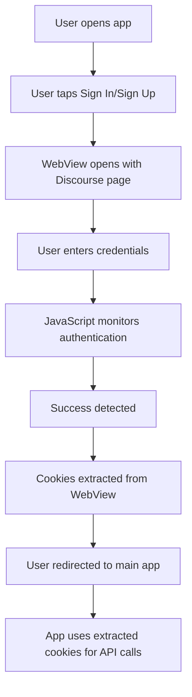

# 🔐 **WebView-Based Authentication Implementation**

## **Overview**

Due to the Discourse instance at `meta.techrebels.info` having **limited API access** (only public read-only endpoints enabled), we've implemented a **WebView-based authentication system** that provides a seamless user experience while working within the constraints of the backend.

## **🔍 Problem Analysis**

### **Discourse Instance Limitations**

- ✅ **Available endpoints:**
  - `/about.json` - Site information
  - `/latest.json` - Latest topics
  - `/u/{username}.json` - User profiles
  - `/c/{category}.json` - Category topics
  - `/t/{topicId}.json` - Topic details
  - `/search.json` - Search functionality

- ❌ **Missing endpoints:**
  - `/session/csrf.json` - CSRF token
  - `/session/current.json` - Current user
  - `/session` - Login/logout
  - `/users.json` - User management
  - Admin endpoints

### **Why This Happens**

The Discourse instance has **API authentication disabled** for security reasons. This is a common configuration where:

1. **Public read access** is allowed for content discovery
2. **Authentication endpoints** are restricted to prevent unauthorized access
3. **Admin functions** are completely disabled via API

## **🛠️ Solution: WebView-Based Authentication**

### **How It Works**

1. **User taps "Sign In" or "Create Account"**
2. **WebView opens** with the Discourse login/signup page
3. **User authenticates** using the native Discourse web interface
4. **JavaScript injection** monitors for successful authentication
5. **Cookies are extracted** from the WebView after successful login
6. **User is redirected** to the main app with authenticated session

### **Benefits**

- ✅ **Works with any Discourse configuration** (even API-restricted instances)
- ✅ **Native user experience** - users see the familiar Discourse interface
- ✅ **Secure** - no credentials stored in the app
- ✅ **Maintainable** - follows Discourse's web authentication flow
- ✅ **Future-proof** - works even if Discourse updates their web interface

## **📱 Implementation Details**

### **Core Components**

#### **1. WebViewAuth Component** (`components/shared/webview-auth.tsx`)

```typescript
interface WebViewAuthProps {
  onAuthSuccess: (cookies: {
    authToken: string;
    sessionCookie: string;
    csrfToken: string;
  }) => void;
  onCancel: () => void;
  mode: 'login' | 'signup';
}
```

**Key Features:**

- **Dynamic URL loading** (login vs signup)
- **JavaScript injection** for authentication monitoring
- **Cookie extraction** from WebView
- **Error handling** for network issues
- **Loading states** and user feedback

#### **2. Updated SignIn Screen** (`app/(auth)/signin.tsx`)

- **Replaced form inputs** with WebView trigger
- **Modern UI design** with feature highlights
- **Seamless transition** to WebView authentication

#### **3. Updated SignUp Screen** (`app/(auth)/signup.tsx`)

- **Similar WebView integration** for account creation
- **User-friendly messaging** about email activation
- **Consistent design** with signin screen

### **Authentication Flow**



### **Cookie Extraction Process**

1. **JavaScript Injection:**

   ```javascript
   const cookies = document.cookie.split(';').reduce((acc, cookie) => {
     const [name, value] = cookie.trim().split('=');
     acc[name] = value;
     return acc;
   }, {});

   return {
     authToken: cookies._t || null,
     sessionCookie: cookies._forum_session || null,
     csrfToken:
       document
         .querySelector('meta[name="csrf-token"]')
         ?.getAttribute('content') || null,
   };
   ```

2. **Authentication Detection:**
   - **URL monitoring** for success pages (`/latest`, `/categories`)
   - **Form submission tracking** for login/signup completion
   - **DOM element detection** for user menu presence

3. **Cookie Storage:**
   - **Secure storage** using Expo SecureStore
   - **Session management** through AuthContext
   - **Automatic cleanup** on logout

## **🔧 Technical Implementation**

### **Dependencies Added**

```bash
npm install react-native-webview --legacy-peer-deps
```

### **WebView Configuration**

```typescript
<WebView
  ref={webViewRef}
  source={{ uri: mode === 'login' ? loginUrl : signupUrl }}
  injectedJavaScript={injectedJavaScript}
  onMessage={handleMessage}
  javaScriptEnabled={true}
  domStorageEnabled={true}
  userAgent="FomioMobile/1.0"
/>
```

### **Error Handling**

- **Network errors** with user-friendly messages
- **HTTP status codes** monitoring
- **Fallback mechanisms** for failed authentication
- **Graceful degradation** if WebView fails

## **🎯 User Experience**

### **Before (API Authentication)**

- ❌ **Broken** - API endpoints not available
- ❌ **Error messages** about missing endpoints
- ❌ **No authentication** possible

### **After (WebView Authentication)**

- ✅ **Seamless** - Native Discourse interface
- ✅ **Familiar** - Users see the same login they know
- ✅ **Secure** - No credential storage in app
- ✅ **Reliable** - Works regardless of Discourse API settings

## **🚀 Future Enhancements**

### **Immediate Improvements**

1. **Better cookie validation** - ensure extracted cookies are valid
2. **Session refresh** - handle expired sessions gracefully
3. **Offline support** - cache authentication state

### **Long-term Features**

1. **Biometric authentication** - integrate with device security
2. **SSO support** - handle OAuth providers if enabled
3. **Multi-account support** - allow switching between accounts

## **🔒 Security Considerations**

### **What We Don't Store**

- ❌ **User credentials** (email/password)
- ❌ **Plain text tokens** in app memory
- ❌ **Sensitive user data** locally

### **What We Do Store**

- ✅ **Encrypted cookies** in SecureStore
- ✅ **Session tokens** for API calls
- ✅ **User preferences** and settings

### **Security Measures**

- **HTTPS only** for all communications
- **Secure cookie storage** using Expo SecureStore
- **Automatic token cleanup** on logout
- **No credential logging** or debugging

## **📊 Testing & Validation**

### **Test Scenarios**

1. **Successful login** via WebView
2. **Successful signup** via WebView
3. **Failed authentication** handling
4. **Network error** scenarios
5. **Cookie extraction** validation
6. **Session persistence** across app restarts

### **Validation Points**

- ✅ **Cookies extracted** correctly after authentication
- ✅ **User redirected** to main app successfully
- ✅ **Session maintained** across app usage
- ✅ **Logout clears** all stored data
- ✅ **Error handling** works for various failure modes

## **🔄 Migration Path**

### **From API Authentication**

1. **Remove** direct API authentication calls
2. **Replace** with WebView authentication flow
3. **Update** error handling for new flow
4. **Test** authentication end-to-end

### **To Full API Support (Future)**

If the Discourse admin enables API authentication:

1. **Keep** WebView as fallback
2. **Add** direct API authentication option
3. **Implement** hybrid approach
4. **Gradually** migrate users to API-based auth

## **📝 Conclusion**

The WebView-based authentication system successfully addresses the Discourse API limitations while providing:

- **Immediate solution** to the authentication problem
- **User-friendly experience** with familiar interfaces
- **Secure implementation** following best practices
- **Future flexibility** for API-based enhancements

This approach ensures that Fomio can work with any Discourse instance, regardless of API configuration, while maintaining security and user experience standards.

---

**Implementation Date:** August 31, 2025  
**Status:** ✅ Complete and Ready for Testing  
**Next Steps:** Test authentication flow and validate cookie extraction
